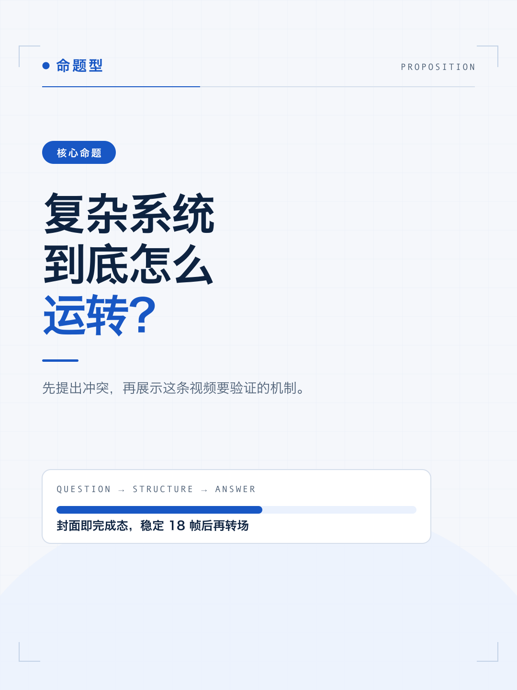
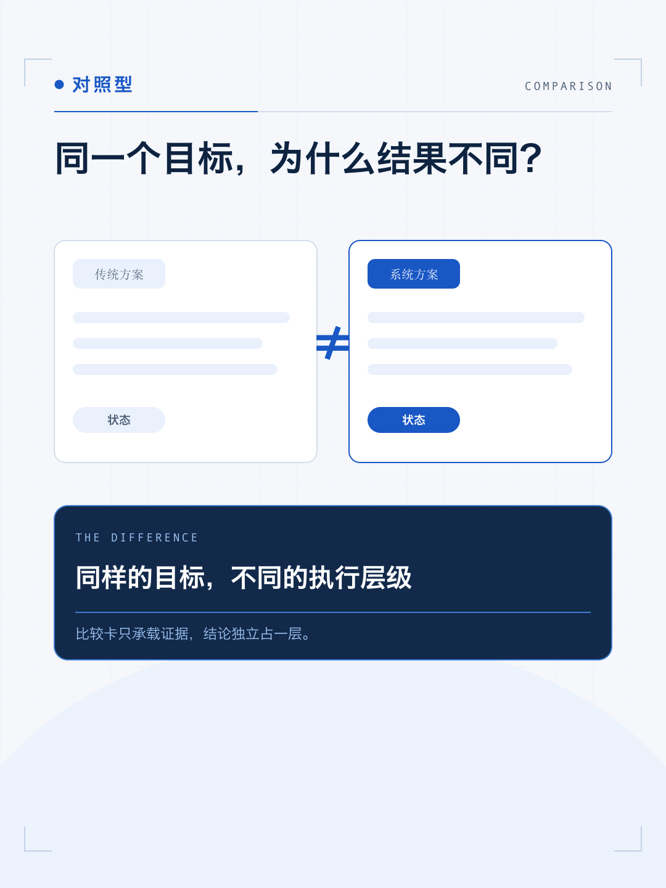
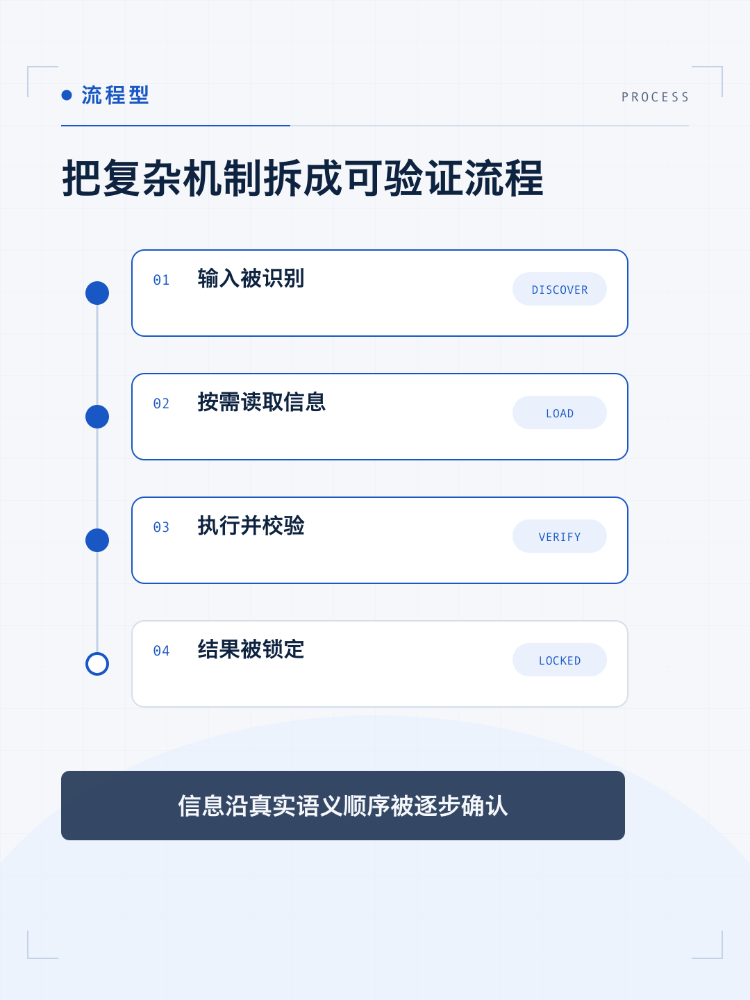
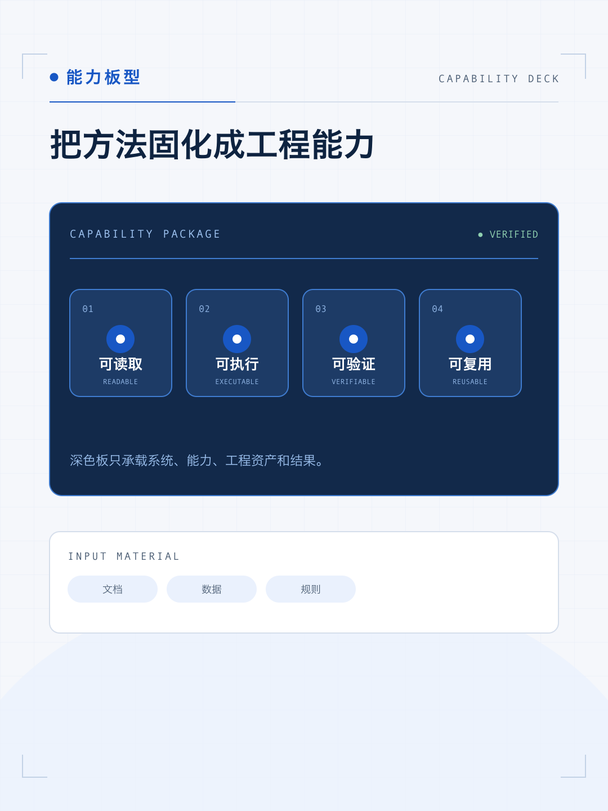
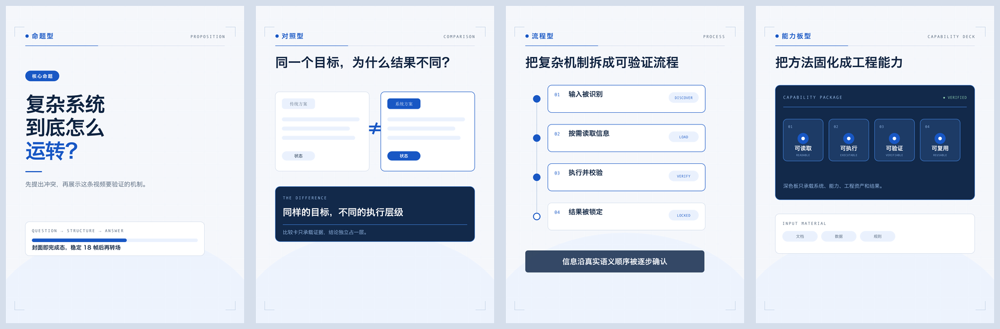

# “清晰系统蓝图”视频风格说明书

- 版本：1.0
- 适用：知识、科技、AI、编程、产品机制、商业与科学教育类竖屏解说
- 基准画幅：1080×1440，30fps

## 1. 风格定位

“清晰系统蓝图”不是一套固定模板，而是一种讲清复杂机制的方法。它把抽象观点转成节点、层级、连线、状态和模块，让观众感觉自己正在看一个系统被逐步发现、读取、执行和验证。

五个关键词：

- **清晰**：先命题，再结构，最后结论。
- **系统**：强调关系，不堆孤立图标。
- **工程化**：画面有步骤、状态和确定性。
- **克制**：高饱和颜色少而准，效果不抢口播。
- **可信**：结构稳定、留白充分、信息能被快速核对。

## 2. 适用与不适用

适合：

- AI、编程、产品原理和工具教学。
- 商业模型、科学概念和复杂流程解释。
- 需要“把抽象机制讲清楚”的知识视频。

不适合直接套用：

- 高情绪娱乐、生活方式、童趣和强消费冲动内容。
- 以人物表演、实拍氛围或奢华影像为主要卖点的视频。

这些题材若要使用本风格，应保留系统信息层，把实拍作为内容素材而不是主品牌层。

## 3. 品牌叙事原则

每个镜头先写一句体验描述，再写布局：

> 观众此刻要看见什么关系？先出现什么，后出现什么？最后哪一个状态被锁定？

优先使用以下叙事动作：

1. **发现**：出现名称、描述、入口或问题。
2. **读取**：展开正文、参数、层级或证据。
3. **执行**：步骤、脚本、流程或转换开始运行。
4. **验证**：结果、差异或风险被确认。
5. **锁定**：结论变成稳定的深蓝锚点。

## 4. 画布、安全区与网格

### 4.1 五层安全区

| 区域 | 左 | 右 | 上 | 下 | 用途 |
|---|---:|---:|---:|---:|---|
| 结构装饰区 | 40 | 40 | 96 | 60 | 角标、网格、弱装饰 |
| 主内容区 | 88 | 88 | 120 | 100 | 普通图形和卡片 |
| 关键文字区 | 88 | 180 | 120 | 260 | 标题、数字、结论 |
| 封面标题区 | 88 | 180 | 260 | 460 | 第 0 帧封面 |
| 字幕区 | 88 | 180 | 990 | 260 | 可选内嵌字幕 |

右侧 180px 和底部 260px 是抖音互动栏与底部 UI 的关键避让区。非关键装饰可以进入，但标题、数字、结论、Logo 和字幕不得进入。

### 4.2 主内容轴

- 左起 88px。
- 标准宽度 904px。
- 标题、章节 kicker、横向结构线通常共用同一左轴。
- 不追求全画面居中；通过左上、右下、上下分区建立视线运动。

## 5. 色彩系统

| Token | 色值 | 用途 |
|---|---|---|
| canvas | `#F5F7FB` | 雾白画布 |
| ink | `#0E2340` | 主标题、正文 |
| engineering_blue | `#1857C4` | 核心强调、节点、结构 |
| capability_deck | `#12294A` | 系统、能力和结果板 |
| blue_tint | `#EAF1FD` | 轻量卡片、进度和骨架 |
| support_gray | `#4E6076` | 辅助说明 |
| structure_line | `#D5DEEB` | 卡片线、分隔线 |
| structure_line_strong | `#C3D2E6` | 外框、角标 |
| warning_red | `#A8412A` | 否定、风险、错误 |
| success_green | `#4FBF8B` | 完成、挂载、通过 |

工程蓝必须在每个信息镜头中至少出现一次，但不应覆盖大面积背景。警示红和成功绿是语义色，不得作为装饰色轮换使用。

## 6. 字体与信息层级

### 6.1 字体角色

- 比例文字与中文：`Inter` + `Hiragino Sans GB` / `PingFang SC` 回退。
- 元数据、代码、编号、英文标签：`JetBrains Mono`。
- 分布式渲染时应显式嵌入中文字体，不依赖仅本机安装的字体。

### 6.2 字号

| 角色 | 字号 | 字重 |
|---|---:|---:|
| 封面标题 | 78–112px | 900 |
| 镜头标题 | 46–64px | 700 |
| 正文 / 结论 | 24–34px | 400–600 |
| 标签 / 元数据 | 18–23px | 700 |

标题行距 0.98–1.08，正文行距约 1.35。英文关键词可以使用工程蓝，但不要使用渐变文字。

## 7. 空间与圆角

### 7.1 留白节奏

- 同组元素：12–20px。
- 堆叠卡片：至少 16px。
- 不同信息组：32–56px。
- 主卡内边距：28–36px。
- 次级卡内边距：22–28px。
- 标签、编号、状态、图标距边缘：至少 22px。
- 骨架屏、列表、进度条最后一行到底边：至少 22px。

### 7.2 圆角

- 8px：小标签、迷你状态块。
- 12px：字幕底、列表项、次级模块。
- 18px：常规卡片。
- 22px：主卡、深色能力板。
- 999px：胶囊、状态、章节 chip。
- 50%：圆形节点和图标。

不要在同一镜头临时发明 14、17、25px 等相近圆角。

## 8. 组件语言

### 卡片

白色或浅蓝填充，1.5–2px 结构线。浅色主卡可以使用 `rgba(14,35,64,0.05–0.07)` 的柔和阴影；不要做网页式小卡片矩阵。

### 胶囊

只用于章节、状态、确认和短标签。胶囊右侧与容器至少留 22px，文字需要做光学校正，不能只依赖几何居中。

### 节点与连线

节点代表状态，连线代表真实关系。进入顺序必须对应因果或执行顺序。虚线表示待发生、弱依赖或未读取；实线表示已建立或已验证。

### 深色能力板

`#12294A` 是最高权重组件，只承载系统、能力、工程资产和最终结果。常规说明不要放进深色板，以免全片失去层级。

## 9. 四类镜头骨架

### 9.1 命题型

用于封面、钩子、章节开场和强结论。一个大判断加一条短解释，最多两个焦点。



### 9.2 对照型

用于旧方法与新方法、原料与结果、条件与结论。左右或上下形成明确对照，最终结论单独占一层，不塞进比较卡。



### 9.3 流程型

用于步骤、层级、因果和状态变化。使用纵向轨道、节点和状态胶囊，不做普通项目符号列表。



### 9.4 能力板型

用于系统、能力、工程资产和验证结果。深蓝板成为视觉锚点，周围保留浅色说明和结构关系。



## 10. 动画语法

### 10.1 三阶段

- **Build 30%**：按信息优先级入场。
- **Breathe 40%**：让信息稳定可读，只保留一种环境动作。
- **Resolve 30%**：锁定结论或快速退场。

### 10.2 品牌动作词

`DRAW`、`SLIDE`、`ASSEMBLE`、`FILL`、`LOCK IN`、`STEP`、`VERIFY`。

入场 0.30–0.60s，使用 ease-out；退场 0.18–0.45s，使用 ease-in。第一动作延迟 0.10–0.30s，避免第 0 帧跳变。一个镜头中相同 ease 的独立 tween 不超过两个。

### 10.3 转场

- 同一因果或同一概念：结构线延伸、推移、速度匹配。
- 新章节、新冲突：硬切或 0.20–0.40s 方向性转场。
- 重要信息进入后稳定 1.0–1.8s，再允许切镜头。

禁止弹跳、橡皮筋、持续漂浮、过度 glitch，以及所有元素同方向同速度入场。

## 11. 字幕、口播与声音

### 字幕

- 可选，最多两行。
- 32–38px，最大宽度 812px，行距 1.30–1.40。
- 每行建议不超过 16 个全角字符。
- 专有名词、英文词组、数字与单位不可拆开。
- 推荐 `rgba(18,41,74,0.84)` 底、雾白文字、14×22px 内边距、12px 圆角。
- 字幕不得遮挡节点、连线、人物脸、数据结论和深色能力板。

### 口播

- 保持人声原速。
- 信息密集段之间留真实停顿。
- 句尾留画面展示时间，不用拉伸人声填时长。

### BGM 与 SFX

- 48kHz 双声道。
- 人声 stem 建议 -18 至 -16 LUFS。
- BGM 建议 -30 至 -26 LUFS；有人声时下压 6–10dB。
- ducking attack 0.04–0.12s，release 0.25–0.60s。
- BGM 淡入、淡出 0.80–1.50s。
- 单个 SFX cue 增益建议 -18 至 -12dB，同时最多两个。
- 成片目标 -16 LUFS ±1，真峰值不高于 -1 dBTP，LRA 2–6 LU。

## 12. 首帧封面

- 第 0 帧必须是完整完成态。
- 默认两行，最多三行；单行不超过 10 个全角字符。
- 标题最大宽度 812px，字号 78–112px。
- 文本与背景最低对比度 7:1。
- 30fps 下至少稳定 18 帧后才允许转场。
- 不得使用黑帧、空白、半透明中间态或必须等动画完成才看懂的封面。

参考证据：


## 13. 不可变项与可变项

### 不可变

- 画布、核心色、字体角色、安全区、空间比例和圆角。
- 四类骨架的语义用途。
- 动作词、三阶段节奏、人声优先的声音目标。
- 字幕、封面、禁用项和验收门槛。

### 可变

- 镜头骨架选择和组合。
- 图形隐喻、图标、节点数量、局部构图。
- 内容图片、产品截图、人物、实拍和第三方 Logo。
- 警示红与成功绿的具体出现位置。

第三方 Logo 只能作为内容素材，不能接管系列主色、字体、圆角或动作语法。

## 14. Do / Don’t

### Do

- 用节点、连线、层级和状态表达真实关系。
- 让最重要的信息先动。
- 保留呼吸区，信息刚读完不要立即切镜头。
- 对问号、箭头、圆形图标和带字距标签做光学校正。
- 让深蓝能力板成为少量、高价值的视觉锚点。

### Don’t

- 不做居中悬浮的网页卡片堆。
- 不增加任意品牌色、渐变文字或紫蓝霓虹。
- 不让标签、编号、图标或骨架屏贴边。
- 不使用弹跳、橡皮筋和每个元素都配 SFX。
- 不让 BGM 覆盖关键词、数字、模型名和结论。

## 15. 制作与验收清单

### 制作前

- [ ] 明确本镜头属于哪种骨架。
- [ ] 写出观众体验和图形隐喻。
- [ ] 标出两个焦点和三个景深层次。
- [ ] 核对关键文字安全区。

### 画面

- [ ] 色值全部来自 token。
- [ ] 字号、间距、圆角符合范围。
- [ ] 标签和图标距边缘至少 22px。
- [ ] 列表/骨架屏底部至少 22px。
- [ ] 无裁切、重叠、错误连接和光学偏移。

### 动画

- [ ] Build / Breathe / Resolve 完整。
- [ ] 入场顺序符合信息优先级。
- [ ] 每镜头最多一种环境动作。
- [ ] 动画确定性、可寻址、任意帧可重建。

### 声音与交付

- [ ] 人声清晰且保持原速。
- [ ] BGM ducking 和淡入淡出正确。
- [ ] SFX 数量受控且不覆盖关键词。
- [ ] 第 0 帧完成并稳定至少 18 帧。
- [ ] 1080×1440、30fps、H.264/yuv420p/BT.709。

## 16. 可复制镜头提示词模板

```text
使用“清晰系统蓝图”风格制作本镜头。

品牌层必须读取并遵守项目根目录 frame.md：
- 不改核心色、字体角色、安全区、间距、圆角、动作语法和声音目标。
- 根据当前文案从 proposition / comparison / process / capability_deck 中选择最合适的骨架。
- 镜头内部图形隐喻、节点数量、局部构图和动画由你根据语义设计。
- 每个镜头至少两个焦点、背景/中景/前景三个层次。
- 使用 DRAW / ASSEMBLE / FILL / LOCK IN / STEP / VERIFY 等机械、精确的动作。
- 保持标签、编号、状态、图标和列表底部留白，不得贴边。
- 输出 1080×1440、30fps、静音、无音轨 MP4。

镜头文案：
{{SCENE_TEXT}}

镜头时长：
{{SCENE_DURATION_SECONDS}}
```

## 17. 风格来源证据

本说明书来自已完成成片的 11 个镜头源码、全片布局复核和封面检查：


四类骨架联系表：



机器使用时，以根目录 [`frame.md`](../frame.md) 的 YAML frontmatter 为规范性来源。
